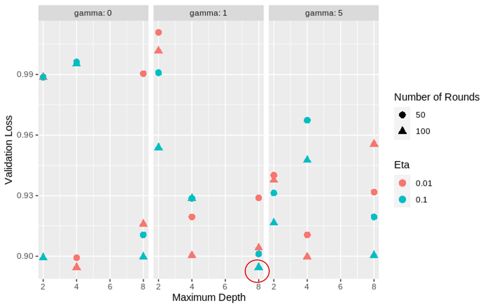
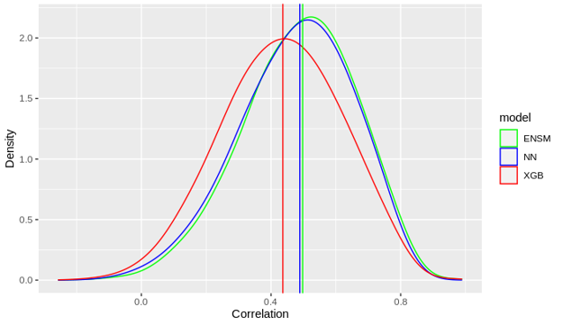

\bigskip


\begin{minipage}[t]{0.5\textwidth}
\centering
Kartika Waluyo

1000555

\emph{School of Mathematics and Statistics}

\emph{The University of Melbourne}

Melbourne, Australia

kwaluyo@student.unimelb.edu.au
\end{minipage}
\begin{minipage}[t]{0.5\textwidth}
\centering
Vrinda Rajendar Rajanahally

1129446

\emph{School of Mathematics and Statistics}

\emph{The University of Melbourne} 

Melbourne, Australia

vrajanahally@student.unimelb.edu.au
\end{minipage}
  
\bigskip
\bigskip 
\bigskip
\bigskip 
\bigskip
\bigskip 
  
\centering
Supervised by:

Dr. Brendan Ansell, WEHI

Dr. Roberto Bonelli, CSL Research 

Dr. Milica Ng, CSL Research

Dr. Monther Alhamdoosh, CSL Research

Prof. Melanie Bahlo, WEHI 

Dr. Ziad Al Bkhetan, The University of Melbourne

Prof. Michael Kirley, The University of Melbourne


\newpage
\tableofcontents

```{r setup, include=FALSE}
knitr::opts_chunk$set(echo = TRUE)
```

\newpage
\centering

# Student Declaration

I certify that this report does not incorporate without acknowledgement any material previously submitted for a degree or diploma in any university; and that to the best of my knowledge and belief it does not contain any material previously published or written by another person where due reference is not made in the text. The report is 6591 words in length (excluding text in images, tables, bibliographies and appendices)

\newpage
\centering

# Acknowledgements
We would like to extend our gratitude to all our supervisors. This would not have been possible without the guidance and support of the following supervisors: 
\bigskip

Primary Supervisors:

Dr. Brendan Ansell, WEHI

Dr. Roberto Bonelli, CSL Research 
\bigskip

Secondary Supervisors:

Dr. Milica Ng, CSL Research

Dr. Monther Alhamdoosh, CSL Research

Prof. Melanie Bahlo, WEHI 
\bigskip

University Supervisors:

Dr. Ziad Al Bkhetan, The University of Melbourne

Prof. Michael Kirley, The University of Melbourne

\newpage

# Abstract
Gene expression is measured through RNA sequencing, as RNA is regarded as a proxy for proteins which perform most biological functions in the human body (Volgin, 2014). Gene expression indicates the activation level of genes in different tissues of the body, and varies substantially between healthy and diseased tissues. This is important to study from a point of view of medical research and testing drug efficacy. Although it is easy to gather gene expression samples from tissues like blood,  we are faced with limitations when it comes to profiling samples of internal tissues like heart, brain and lung as they require more invasive procedures to collect. To overcome this challenge, we investigated the ability of machine learning algorithms such as extreme gradient boosting and neural networks to reliably predict gene expression of tissues when only gene expression measurements of blood are available. We assess the models’ performance based on different criteria like Mean Absolute Error, Mean Square Error and Pearson correlation coefficient and also compare their results against each other. The median training correlation and median test correlation of the XGBoost and the neural network models were 0.99, 0.436 and 0.627 and 0.488 respectively. From these values, we observe that the XGBoost model is overfitting whereas the neural network model generalises much better in comparison. As a proof of concept, we also created a simplistic stacked ensemble model. We found that the median training correlation is 0.920 and the median test correlation is 0.497 which indicates that it is, comparatively, the better prediction model. Finally, we list the future directions that can be taken to improve the scope of this project in later attempts.

\newpage
\raggedright

# 1 Introduction 

## 1.1 Background and Aims 

Exploration of gene expression patterns in healthy and diseased tissue has been vastly utilised to better understand disorders mechanisms and potential treatments. Diseased tissue often exhibits a different gene expression ‘signature’ than healthy tissue. Gene expression is a measurement of the “activation status” of genes in a specific tissue, measured through RNA sequencing. Proteins are produced based on RNA which is transcribed from DNA, and are responsible for the majority of metabolic activities in living tissues (Volgin, 2014). Since protein is difficult to measure, RNA sequencing is used as it is cheap and it is also considered as a proxy for protein abundance (Mackenzie, 2018). 

Gene expression is easily achievable for tissues such as blood, skin and muscle, but limitations exist when profiling tissues like the heart, brain and lungs. Obtaining samples from such tissues requires more invasive procedures and in some cases, can only be obtained post-mortem. Such limitations affect our ability to investigate complex diseases and conditions. For example, lung tissue is difficult to access especially in patients. Respiratory disorders like Asthma, Chronic Obstructive Pulmonary Disease (COPD), Idiopathic Pulmonary Fibrosis (IPF), Lung Cancer exert a huge public health burden, contributing to an estimated loss of 5.4% disease-adjusted life years around the world in 2008 (The Burden of Lung Disease, 2021). 

To overcome the challenge of inaccessible gene profiles for certain tissues, it would be valuable to determine the correlation and predictive value of gene expression signatures in accessible tissues such as blood, compared with signatures in less accessible tissues. 

To this end, our project aims to develop machine learning models that can reliably predict gene expression in different tissues when only the measurements of gene expression in Whole Blood are available. The benefits of this endeavor range from better understanding of disease genetics and molecular pathology to earlier and more accurate diagnosis for patients. 

The GTEx consortium contains publicly available data on gene expression of 54 post-mortem tissues from almost 1000 disease-free individuals. It is an extremely valuable and widely used repository (GTEx Portal, 2021), which has been used, among other purposes, to investigate the relationship between genetic variation (DNA) and gene expression (RNA).  

The GTEx database RNA represents an excellent dataset for proof of concept investigations of the predictive value of gene expression between tissues. For example, Basu and colleagues (Basu et al., 2021), trained an algorithm based on the GTEx data for 32 primary tissues, to predict tissue-specific gene expression using nested linear regression modelling. To find the list of genes whose expression in Whole Blood contributed significantly towards the expression prediction, Principal Component Analysis (PCA) was used. The top five principal components (PC) were considered, and in each PC the top 20 genes that were the most correlated to the respective PC were identified. This yielded 100 genes across all five PCs that contributed to the tissue specific gene expression prediction. 

From their results, ~60% of the tissue-specific gene expression could be predicted at a significant level from the expression of Whole Blood. It was also found that their method had a 70% chance of detecting the correct biomarker genes from specific tissues while Whole Blood only had a 50% chance (Basu et al., 2021). 

This approach highlights the potential additional value of publicly available data from GTEx and how such datasets can be used to train machine learning algorithms to reliably predict tissue-specific gene expression from the transcription of Whole Blood alone. 

While the scope of work from Basu and colleagues is large and could potentially become a technique used to predict any tissue’s gene expression from another, there were limitations to their study. Firstly, their approach considers a set of the same genes determined by principal component analysis (PCA) for prediction, hence it is not compatible with unseen data as unseen data can consist of additional information on many other genes. Secondly, their approach collapses all gene expression from Whole Blood into five principal components (PC), hence potentially losing large amounts of information from single genes alone which affects the overall prediction power. An assumption that is made while collapsing the genes into PCs assumes that the correlation structure of the GTEx data is similar to the input data of a user, which may not always be the case. Lastly, the linear modelling approach used by Basu and colleagues is relatively simple and might fail to capture more complex non-linear relationships between blood gene expression and that of another tissue (Basu et al., 2021). 

Compared to linear models, machine learning methods such as extreme gradient boosting and neural networks have distinct advantages for learning complex relationships within gene expression datasets. Some of the advantages include: 

1. Machine learning methods can produce more accurate prediction models, when compared to methods like regression. 

2. XGBoost and neural network methods can find patterns in data that cannot be easily learnt by linear methods. 

3. XGBoost and neural networks can produce highly accurate and complex models compared to linear models, where insufficient parameters can adversely affect accuracy (Koo et al., 2013).

With these points in mind, we aimed to develop and implement machine learning algorithms to underpin high performing prediction models. 

## 1.2 About the Data 

As mentioned previously, Genotype-Tissue Expression (GTEx) portal is a comprehensive public resource to study tissue-specific gene expression and regulation. This portal provides access to genotype and gene expression data, histology images, and other assets. The data in GTEx is built on samples collected from 54 tissue sites from over 1000 individuals. It is an important resource that aims to increase the understanding of how changes in genetic sequence can affect gene expression, human health and disease (GTEx Portal, 2021).


The data used in this project was downloaded, and preprocessed by the client. The pre-processing involved: 

1. Filtered genes whose expression was too low in each tissue

2. Obtained log-Counts Per Million (logCPM) for each gene

3. Removed systemic differences in gene expression such as the effect of sex at birth, age, and cause of death.

The resulting data consisted of 54 tissue-specific data frames containing de-identified donor information (Subject IDs) and gene expression information per gene (Gene IDs).

## 1.3 Recap of Semester 1 

In the first part of this project, data exploration was performed to understand the nature of the data and to prioritise tissues for analysis. 

Visualisations such as heatmaps gave us an understanding of the highest count and proportion of shared donors and shared genes across all tissues. Barplots were also used to visualise the similarities between each tissue when compared to Whole Blood. By observing these similarities based on the count and proportion of donors and genes shared between tissues, we were able to roughly determine tissues that were similar in gene expression, in order to maximize data overlap between datasets.

To further explore the relationship between tissues and Whole Blood, Pearson correlation coefficient and absolute correlation, were used to understand the pairwise similarities between tissues. Finally to select tissues for further analysis, we ranked the tissues based on proportion of overlapping donors, proportion of shared genes and correlation between expression levels. From this list of ranked tissues, we chose the Lung as a starting point for further analysis and model deployment. Lung had an average rank of 5.6, across all measures and was selected as it had a high overlapping number of donors and expressed genes with Whole Blood, as well as high correlation  with Whole Blood and was considered as the ‘best case scenario’ to test how the models will perform with this tissue.

It is also important to mention that, upon finding shared donors and shared genes across all tissues with Whole Blood, the gene expression data for Lung went through a second stage of preprocessing. In this stage, only its shared donors and shared genes with Whole Blood were extracted. This was the final data that was used throughout the modelling phase.

Neural Network and Extreme Gradient Boosting (XGBoost) were the machine learning models that were considered as best suited for the task. Although these modelling methods require comprehensive cross-validation to confirm their accuracy and can be challenging to interpret due to high dimensionality, they train very quickly and also come with the advantage of handling prediction tasks reliably (Gupta, 2020).

## 1.4 Plan for Semester 2

In the second part of this project, we considered the gene expression data of Lung (consisting of shared donors and genes with Whole Blood) which was trained on the neural network and XGBoost models. The two models were trained over several weeks involving testing of various combinations of hyperparameters, to get the best prediction model possible. Since hyperparameter tuning is a crucial part of the modeling process, we used grid searching to find the best combination of parameters for both models. The neural network and XGBoost Lung gene expression prediction results were finalised and compared to the test data actual values on the basis of Pearson correlation coefficient. Lastly, comparison between single model prediction and ensemble model prediction accuracy was assessed.

# 2 Methods 

## 2.1 Cross Validation

To assess the performance of the models, we require three key components: a training set which is used to train the model; a test set, which is completely unseen by the model and used to evaluate its performance. Additionally, we also require a validation set for model refinement and selection, as this can help us achieve a generalized and unbiased result and avoid over-fitting. 

To fulfill these requirements, we use cross validation, which is a method that evaluates machine learning models based on partitioning a sample of the data. It considers one parameter known as ‘k’, which represents the number of groups the sample data is divided into (Medium, 2020). 

In our approach, as illustrated in **Figure 2**, we first divide the dataset of shared gene expression of Whole Blood and Lung by 80:20 ratio into a training set (374 samples) and a test set (93 samples). The training set is further divided into k=5 folds for a 5-fold cross validation. During each iteration of the cross validation, one fold of the training data is used as the test set while the remaining folds are combined and used as the training set. After choosing the best hyperparameters through the gridsearch, we train the model using the entire data set before finally evaluating using the test set.


## 2.2 Extreme Gradient Boosting (XGBoost)

### 2.2.1 Boosting as a Machine Learning Technqiue

Boosting is a machine learning technique that is also categorised as an ensemble method. The intuition behind this technique is that it starts with fitting models sequentially, such that each successive model aims to have better predictability than the previous model (Schapire, 2013). In gradient boosting, the models are usually referred to as decision trees. 

To further explain this concept, the modelling starts with fitting an initial tree using the entire dataset. The tree built after this will focus on predicting the cases that the first tree was not able to predict accurately (Schapire, 2003). This process of boosting is repeated over a number of times, where each successive tree learns from its preceding trees and attempts to reduce the residual error of the previous trees.

### 2.2.2 Gradient Boosting 

Gradient boosting is a machine learning boosting technique which makes the assumption that the next best model is achieved when combined with all previous models, together minimising the overall residual error (Friedman, 2002). This method is called ‘gradient boosting’ as it uses gradient descent algorithms to minimise the loss while repeatedly adding new models (Chen & Guestrin, 2016). 

Gradient Boosting approach is given by 

$F_n = F_{n-1} + \eta\Delta_n$  (1)

where where $F_n$ is the current model, $F_{n-1}$ is the previous model, $\eta$ is a learning rate (defined below), and $\Delta_n$ is the difference between residuals from the current model and the previous model. 

### 2.2.3 eXtreme Gradient Boosting (XGBoost)

XGBoost is a scalable end-to-end tree boosting system implemented in R (packages: caret, xgboost), which allows us to utilise decision tree-based algorithms. It supports various objective functions such as regression and classification. Since we are dealing with quantitative data, our approach involves regression predictive modelling. An illustration of how XGBoost works is shown in **Figure 3**.


The formula 

$F_m(X) = F_{m-1}(X) + a_mh_m(X,r_{m-1})$   (2)

has $a_m$ as the learning rate and $h_m$ as the residual difference. It is in the same form as equation (1).

### 2.2.4 XGBoost Hyperparameters

A hyperparameter is regarded as a constraint or threshold on the model, which when tuned can have an impact on the training process of a model. 

The XGBoost package provides a large number of hyperparameters(XGBoost Parameters — Xgboost 1.6.0-Dev Documentation, 2021), which can be tuned to return the optimal model. The main hyperparameters considered in our model are as follows: 

1. gamma (min_split_loss)
+ Representing the minimum loss reduction required to make a further partition on a leaf node of the tree. 
+ The larger the Gamma is, the more conservative/robust the algorithm will be. 
+ It can take any values between 0 and $\infty$. 

2. max_depth
+ Representing the maximum depth of each tree. 
+ By increasing the maximum depth, the model is likely to become more complex and tends to overfit. Deep trees can turn out to consume a lot of memory and must be carefully tuned. 
+ It can take any values between 0 and $\infty$. 

3. m (num_round)
+ Representing the number of trees (or rounds) that the model must create for boosting.
+ A large number of trees helps to build a comprehensive model, but requires some level of caution as it can tend to overfit.
+ It can take any values between 0 and $\infty$.

4. eta (learning_rate)
+ Representing the step size shrinkage used in update trees to prevent overfitting. + After each boosted tree is created, eta is used to shrink the feature weights to make the model more robust. 
+ It can take any values between 0 and 1.

### 2.2.5 Gridsearch on XGBoost Hyperparameters

Each combination of hyperparameters can result in different models varying in performance. In order to obtain a model with maximal prediction accuracy, the tuning results are summarized and compared (Kuhn & Johnson, 2018).

Gridsearch is one such traditional technique used in hyperparameter tuning of a model. It iterates through a set of predefined hyperparameters and generates a result for each hyperparameter set. Next, those results are examined and the hyperparameter set that gives the best result is chosen, which can then be used in the final model training (Hyperparameter Tuning in XGBoost - Cambridge Spark, 2019). 

The gridsearch method also generates a loss function, whose role is to estimate the performance of the model prediction on the training data compared to the validation data at every hyperparameter combination in searches. Monitoring the loss function can mitigate against over-fitting. In our approach, we consider Mean Square Error (MSE) as the loss function, that helps us visualise and evaluate various combinations of the hyperparameters.

Once the gridsearch is complete, we choose the best combination of hyperparameters that is associated with the least value of MSE. 

### 2.2.6 Basis of XGBoost Model Evaluation

After training the model with the optimal hyperparameters, we come to model evaluation based on its prediction capabilities. In our approach, we consider Mean Absolute Error (MAE) and Mean Square Error (MSE). We also utilise Median Correlation and density plots to understand the fit of the XGBoost model and to assess the relationship between the gene expression of Whole Blood and Lung.

## 2.3 Neural Network

Over the past few decades, neural networks modelling has been considered as one of the most powerful tools, and its ability to handle a huge amount of data made it very popular in the literature. Having deep hidden layers in the models has recently become an interest that has started to surpass classical methods performance in many fields, especially in pattern recognition. By using neural networks, the idea of setting up a lightly parameterised function shaped by humans can be forgotten. Instead, it allows us to set up a highly parameterised function that is very flexible and will be conveniently shaped during the learning phase. To put it simply, a deep learning model automatically learns complex functions that map inputs to outputs and rules out the need to use hand-crafted features (Singh et al., 2016). Since the input data of this project has a very large feature dimension, neural network is considered as one of the suitable approaches.


The idea of neural networks came from the brain. The human brain is made up of billions of basic units called neurons. **Figure 4** illustrates the basic neuron unit. The neuron is made up of dendrites, a cell body and an axon connecting to axon terminals. The brain will receive information or inputs which are then transferred into the cell body through dendrites. The cell body works as the processing unit, where all the learnt information is then transferred into outputs and passed down by the axon. The muscles then receive the outputs from the axon terminals for actions.

### 2.3.1 Perceptron

In machine learning, a single layer artificial neural network, also known as perceptron, consists of an artificial dendrite (input layer), an artificial cell body (hidden layer), and an artificial axon (output layer) (Shynk, 1990). In **Figure 5**, all explanatory variables in input neurons are attached to weights (hidden layer). Once multiplied together, they are then added together to produce the weighted sum. Once the activation function is then applied on the weighted sum, the output is generated.


### 2.3.2 Multi-Layer Neural Network

A Multi-layer neural network consists of many perceptrons. This network consists of an input layer, hidden layers and an output layer. Each neuron in the input layer feeds information to the first hidden layer, its output is passed to the second hidden layer, and the process continues to transfer information to as many hidden layers present in the network (Gardner & Dorling, 1998). Each hidden layer is associated with weights, and the right weight size plays a role in minimising the errors on the training dataset. The output layer is generated once all computations have been completed and transferred on from the last hidden layer. A neural network can be trained by iterating over samples in the training dataset.

**Figure 6** is a rough example visual representation of our neural network model. The input layer consists of Whole Blood gene expression, and the output is Lung gene expression.


### 2.3.3 Algorithm of Backpropagation 

Backpropagation is one of the most widely used learning algorithms in a neural network. It is an iterative algorithm used to find the optimal weights for the hidden layers which minimises error (Wu & Feng, 2017). In **Figure 7** we see that at first the weights are randomly initialized, then for each training instance, for each weight, the predicted output is computed. The algorithm updates the weights based on the predicted and actual y values in every iteration, also known as epoch, until the minimal error condition is met.


In **Figure 8**, we have illustrated an example of what our neural network may visually look like. The input in this network is the Whole Blood gene expression. We can see the different hidden layers, where each of them are learning from one another to output Lung gene expression.


### 2.3.4 Neural Network Hyperparameters

Similar to the XGBoost model, it is possible to tune neural network hyperparameters (Tuning the Hyperparameters and Layers of Neural Network Deep Learning, 2021) to help improve the model prediction accuracy. Some important hyperparameters include: 

1. Activation function
+ Used to accustom the model with nonlinear patterns. 
+ Allows for the model to learn nonlinear prediction boundaries. 

2. Hidden layers
+ This represents the layers in between the input and output layers. 
+ Also represents the structure of the network 

3. Learning rate
+ This represents how quickly the model is learning and updating based on its parameters.
+ A low learning rate can result in a smooth learning process

4. Epoch number
+ This hyperparameter defines the number of iterations the algorithm needs to run through the entire dataset.
+ More epochs can result in a deeper and better training of the data. 

### 2.3.5 Gridsearch on Neural Network Hyperparameters

Since the optimal values of the hyperparameters in the neural network are context-dependent, we run a gridsearch similar to the XGBoost gridsearch. 

Mean Square Error (MSE) is once again considered as the loss function, that helps us visualise and evaluate various combinations of the hyperparameters. Once the gridsearch is complete, we choose the best combination of hyperparameters that is associated with the least value of MSE.

### 2.3.6 Basis of Neural Network Model Evaluation

Similar to the XGBoost model, after training the neural network model with the optimal hyperparameters, we come to model evaluation to test its prediction capabilities. We consider Mean Absolute Error (MAE) and MSE yet again as a means of evaluation. We also utilise Median Correlation and density plots to understand the fit of the XGBoost model and to assess the relationship between the gene expression of Whole Blood and Lung.

## 2.4 Stacked Ensemble Model

Stacked ensemble modelling is popularly known for having better performance accuracy than most machine learning modelling methods, as it involves more than one learning algorithm. The intuition of the stacked ensemble algorithm is to combine all predictions of the other learning algorithms to make a final prediction (Sagi & Rokach, 2018). It can be successfully deployed on supervised learning (regression) and unsupervised learning tasks (estimation).

As a proof of concept, we created a simplistic version of an ensemble model prediction by taking the average of our XGBoost and neural network prediction models as shown below:

$$
ENSpred = \frac{1}{2}NNpred + \frac{1}{2}XGBpred =
\frac{1}{2}\begin{bmatrix}
\hat{y}_{11} & \cdots & \hat{y}_{1p}\\
\vdots & \ddots\\
\hat{y}_{n1} & \cdots & \hat{y}_{np}\\
\end{bmatrix} + 
\frac{1}{2}\begin{bmatrix}
\hat{z}_{11} & \cdots & \hat{z}_{1p}\\
\vdots & \ddots\\
\hat{z}_{n1} & \cdots & \hat{z}_{np}\\
\end{bmatrix} (3)
$$

# 3 Results

## 3.1 Results of XGBoost Model

We set the entire Whole Blood gene expression matrix as the input for the XGBoost model, to predict as the output the expression of one gene in the Lung. It is important to note that we create one model per gene expression of Lung, as the XGBoost algorithm does not generate multivariate output. 

To find the best hyperparameters of the XGBoost model, we ran a gridsearch using Mean Squared Error (MSE) as the loss function. Since it was anticipated that the grid search would take an extensive amount of time to run, our approach was to first tune and train the model on 50 randomly selected genes. The range of the hyperparameters were set as follows: 

1. Gamma = (0, 1, 5),
2. Maximum depth = (2, 4, 6, 8),
3. Number of trees = (50, 100),
4. Learning rate (eta) = (0.01, 0.1).

**Figure 9** shows the gridsearch results for our XGBoost model.



This initial training lasted for approximately 10 hours, at the end of which resulted in the best combination of hyperparameters, with the lowest MSE. As presented in **Figure 9** The combination is given as follows: 

1. Gamma = 1,
2. Maximum depth = 8,
3. Number of trees = 100,
4. Learning rate = 0.1. 

Using this combination of hyperparameters, we then train the entire dataset of all the genes. For the final model, we observe the following Mean Absolute Error (MAE) and MSE on the training and test set as shown in **Table 1**. This indicates that, as expected, the model performs better on the training data than the unseen test data.

```{r echo=FALSE}
library(knitr)

xgb_result = data.frame(MAE=c(0.1775177,0.6653771), MSE=c(0.05393484, 0.735219))
rownames(xgb_result) = c("Training", "Test")
```

## 3.2 Results of Neural Network Model

Similar to XGBoost, a gridsearch was used to tune and find the best combination of hyperparameters for the neural network model, where MSE was once again considered as the loss function. We also set the activation functions as Relu for hidden layers and Linear for the output layer.  The range of the hyperparameters were set as follows and were trained for the entire dataset: 

1. Epochs = (10, 30, 50, 100, 200, 500),
2. Number of (hidden) layers = (1, 3, 5, 7, 90), 
3. Learning rate = ($1^{5}$, $1^{5}$, 0.001, 0.01). 

**Figure 10** shows the gridsearch results for our neural network model.


The gridsearch ran for approximately 12 hours to train the entire dataset, for which the best combination of hyperparameters have the lowest MSE. They are given below: 

1. Epochs = 200,
2. Number of (hidden) layers = 1, which can be interpreted as one hidden layer of 100 unit,
3. Learning rate = $1^{5}$.

From this combination of hyperparameters for the final model, in **Table 2** we observe the following Mean Absolute Error (MAE) and Mean Square Error (MSE) on the training and test set.

```{r echo=FALSE}
library(knitr)

nn_result = data.frame(MAE=c(0.5993975,0.6464047), MSE=c(0.6128888, 0.6931747))
rownames(nn_result) = c("Training", "Test")

```

Compared to the XGboost model, the difference between performance on the training and test data for the neural network model is not significant.

## 3.3 Evaluation of Correlation Coefficients of all Models

After using grid search to find the ideal combination hyperparameters for the XGBoost and neural network models, we calculate the Pearson correlation coefficient for the model’s predicted output compared to the actual Lung data. We use median correlation to evaluate how the models are performing and to check which model fits the data better. 

From Basu and colleagues’ implementation, we see that after fitting the regression model they use Pearson correlation coefficient to estimate the accuracy between the predicted and actual data. The correlation found by their implementation was found to be approximately 0.3 (Basu et al., 2021) and hence, in our evaluation we aim to return a correlation higher than this value for each of our models. 

After concluding the hyperparameter tuning for each model and tuning them using the best parameters, their respective correlation coefficients are tabulated in **Table 3**.

```{r echo=FALSE}
library(knitr)

coef_result = data.frame(Training=c(0.990975,0.6278658,0.9205496), Test=c(0.4364947, 0.4887672,0.4976427))
rownames(coef_result) = c("XGBoost", "Neural Network", "Ensemble")
```

**Figure 11** shows the test prediction correlation for all models with its median line.



## 3.4 Results Interpretation 

As shown in **Table 2**, the neural network training prediction has a MAE=0.599. Because in the data pre-processing it is centered around the mean and scaled on the standard deviation, MAE=0.599 means that the training predictions are on average 0.599 standard deviation away from the original values. The test prediction from the neural network model has a MAE=0.646, meaning that the test predictions are on average 0.646 standard deviation away from the original values. Similarly for XGBoost model; the training predictions are on average 0.177 standard deviation away from the original values, and the test predictions are on average 0.665 standard deviation away from the original values

Moreover, the median correlation can be interpreted as a threshold value that splits the correlation data into two equal parts. As shown in **Table 3**, for XGBoost, the median correlation of the test prediction is 0.436, meaning that half of the genes have a prediction-actual correlation more than 0.436. Similarly, half of the genes have a correlation more than 0.488 for the neural network model, and 0.497 for the ensemble model.

# 4 Discussion 

## 4.1 Patterns Observed in Hyperparameter Tuning

In the XGBoost grid search results presented in  **Figure 9**, we observe that the best combination of hyperparameters are when the model has a large number of deep trees, with a comparatively high learning rate. This is justified as models with lower number of trees and slower learning rate do not tend to have high good prediction accuracy. By increasing the number of trees, tree depth and learning rate we will be left with more accurate predictions and a model that does not tend to overfit. 

In the neural network grid search results presented in **Figure 10**, we observe a distinct pattern when the learning rate is $1^{5}$ in the above image, represented by the pink points on the graph. When the epochs assume a lower value, the loss decreases as the number of layers increases. On the other hand, when the epochs are larger values, the loss increases as the number of layers increases. This is justified as training the model with lower epoch is rather a quick training, and requires a deeper and wider model to fit better. However, when we train the model with a higher epoch, the model will tend to overfit as the training gets deeper and wider.

## 4.2 The Burden of Training Time 

Gridsearch is the most common and efficient method of hyperparameter selection. This technique involves a brute force approach, where it creates and tests models based on different hyperparameter combinations. Additionally, at every point of the gridsearch, the grid needs k-fold cross validation, which requires k training steps. 
Although it is a very thorough search, it can be very expensive to run as it is very exhaustive. Computational constraints can pose additional challenges and can limit hyperparameter testing.

As mentioned previously, the initial hyperparameter gridsearch for the XGBoost model ran on 50 random genes. This took approximately 10 hours, resulting in the most optimal hyperparameters. The entire dataset was then trained using the resulting hyperparameters. On the other hand, the hyperparameter tuning on the neural network model took approximately 12 hours for the entire dataset. Hence, the neural network presented a much more effective training capability than XGBoost.
If it were not for the exhaustive nature of the gridsearch technique and computational constraints, we would have been able to trial a larger combination of hyperparameters for both models.

## 4.3 Comparing the Models

All three models presented a correlation coefficient that is higher than Basu and colleagues’ correlation of 0.3, indicating that these modelling methods have higher gene prediction accuracy in the GTEx data. We observe that there is a difference between the performances of the XGBoost and neural network models, which can be because the latter has a better learning and modelling capability when it comes to complex relationships and prediction. Furthermore, From **Table 3** it can be seen that the XGBoost training prediction correlation (0.99) is significantly higher than the test prediction correlation (0.43), which means that the XGBoost model heavily overfits. In contrast, for the neural network model, the training prediction correlation (0.62) is only slightly higher than the test prediction correlation (0.48), which suggests that the neural network model generalizes much better than XGBoost model.

Nonetheless, both models have good predictability and hence, we consider the correlation of the ensemble model. As seen in **Figure 11**, the correlation coefficient of the stacked ensemble is higher than both models suggesting further implementation use for future analyses.

# 5 Future Analysis Plan 

Our neural network and XGBoost models are a first step towards finalising the right model for predicting genes in inaccessible tissues from Whole Blood. Through the course of this project, we have identified the steps that must be taken further to achieve the bigger picture. They are listed as follows:

1. Training the models on all other tissues, on the entire dataset:  

In our attempt to find the best suited model for all tissues, we initially trained only the data from Lung, which consisted of its shared genes and donors with Whole Blood. Using the tuned models from this attempt, the next step would be to train on the data of the other 53 tissues. It is also important to consider the entire dataset of each tissue, and not just the shared donors and genes with Whole Blood. The correlation coefficients can be calculated once again to check if the models continue to perform with a significant correlation to the original data. 

2. Stacking ensemble for improved prediction:  

Stacking ensemble is a method that utilises multiple algorithms or models to produce one optimal prediction model (Khandelwal, 2021). As we have seen in our results, the ensemble correlation of the neural network and XGBoost models are higher than their individual correlations. We can conclude that using a stacking ensemble method of modelling could lead to better performance. In the context of this project, better performance would mean that the stacked ensemble will have improved accuracy in predicting genes of a particular tissue, from Whole Blood alone. 

3. Biological validation using differential expressions:  

As demonstrated by Basu and colleagues, differential expressions can be used for biological validation. We consider the expression dataset of diseases and controlled genes of Whole Blood and another tissue, say Lung from the same patients. We move on to predict the gene expression in Lung using our algorithm. We perform a different gene expression analysis in Whole Blood, Lung and predicted expression of Lung. Finally, we assess whether the significant gene expression in Lung is more similar to those significant in predicted Lung than those in Whole Blood (Basu et al., 2021).

4. Implementation of the web application

An additional and important stage of this project is creating and implementing a web application, which is available publicly with a simple user interface. The application must be able to take the least amount of gene information based on Whole Blood from a user and output predicted genes in the tissues that the user is interested in. This application will run on an algorithm based on the final model chosen for prediction.

# 6 Conclusion

Based on the presented results, we can conclude that our machine learning models perform an improved task of predicting the gene expression of Lung from the gene expression of Whole Blood, when compared to the linear models created by Basu and colleagues. Our attempt lays the premise of utilising and deploying machine learning methods to create predictive models in future attempts that aim for increased accuracy and high reliability. 

While further study and research is required, this attempt brings us one step closer to a better understanding of diagnostics and treatment of diseases in humans.

\newpage

# Access to Code and Meeting Minutes

Our project GitHub Repository: https://github.com/kwaluyo/CSL-Data-Science-Project

# Bibliography 

Basu, M., Wang, K., Ruppin, E., & Hannenhalli, S. (2021). Predicting tissue-specific gene expression from whole blood transcriptome. Science Advances, 7(14). https://doi.org/10.1126/sciadv.abd6991

Chen, T., & Guestrin, C. (2016). XGBoost. Proceedings of the 22nd ACM SIGKDD International Conference on Knowledge Discovery and Data Mining. Published. https://doi.org/10.1145/2939672.2939785

Friedman, J. H. (2002). Stochastic gradient boosting. Computational Statistics & Data Analysis, 38(4), 367–378. https://doi.org/10.1016/s0167-9473(01)00065-2

Gardner, M., & Dorling, S. (1998). Artificial neural networks (the multilayer perceptron)—a review of applications in the atmospheric sciences. Atmospheric Environment, 32(14–15), 2627–2636. https://doi.org/10.1016/s1352-2310(97)00447-0

GTEx Portal. (2021). Gtex Portal. https://www.gtexportal.org/home/ 

Gupta, S. (2020, June 23). Pros and cons of various Machine Learning algorithms. Medium. Retrieved October 29, 2021, from https://towardsdatascience.com/pros-and-cons-of-various-classification-ml-algorithms-3b5bfb3c87d6 

How XGBoost Works - Amazon SageMaker. (2021). AWS. Retrieved October 29, 2021, from https://docs.aws.amazon.com/sagemaker/latest/dg/xgboost-HowItWorks.html

Hyperparameter tuning in XGBoost - Cambridge Spark. (2019, December 23). Medium. Retrieved October 29, 2021, from https://blog.cambridgespark.com/hyperparameter-tuning-in-xgboost-4ff9100a3b2f

Khandelwal, Y. (2021, August 13). Ensemble Stacking for Machine Learning and Deep Learning. Analytics Vidhya. Retrieved October 29, 2021, from https://www.analyticsvidhya.com/blog/2021/08/ensemble-stacking-for-machine-learning-and-deep-learning/ 

Koo, C. L., Liew, M. J., Mohamad, M. S., & Mohamed Salleh, A. H. (2013). A Review for Detecting Gene-Gene Interactions Using Machine Learning Methods in Genetic Epidemiology. BioMed Research International, 2013, 1–13. https://doi.org/10.1155/2013/432375 

Kuhn, M., & Johnson, K. (2018). Applied Predictive Modeling. Springer Publishing. https://doi.org/10.1007/978-1-4614-6849-3

Mackenzie, R. J. (2018, April 6). RNA-Seq: Basics, Applications and Protocol. Technology Networks. Retrieved October 29, 2021, from https://www.technologynetworks.com/genomics/articles/rna-seq-basics-applications-and-protocol-299461 

Medium. (2020, August 19). Why and how to Cross Validate a Model? - Towards Data Science. Retrieved October 29, 2021, from https://towardsdatascience.com/why-and-how-to-cross-validate-a-model-d6424b45261f

Sagi, O., & Rokach, L. (2018). Ensemble learning: A survey. WIREs Data Mining and Knowledge Discovery, 8(4). https://doi.org/10.1002/widm.1249 

Schapire, R. E. (2013). Boosting: Foundations and Algorithms20131Boosting: Foundations and Algorithms. The MIT Press, 2012. xv +526 pp. Cloth, $50.00 or £34.95, ISBN: ‐10: 0‐262‐01718‐0; ‐13: 978‐0‐262‐01718‐3. Kybernetes, 42(1), 164–166. https://doi.org/10.1108/03684921311295547

Schapire, R. E. (2003). The Boosting Approach to Machine Learning: An Overview. Nonlinear Estimation and Classification, 149–171. https://doi.org/10.1007/978-0-387-21579-2_9

Singh, R., Lanchantin, J., Robins, G., & Qi, Y. (2016). DeepChrome: deep-learning for predicting gene expression from histone modifications. Bioinformatics, 32(17), i639–i648. https://doi.org/10.1093/bioinformatics/btw427

Shynk, J. (1990). Performance surfaces of a single-layer perceptron. IEEE Transactions on Neural Networks, 1(3), 268–274. https://doi.org/10.1109/72.80252

The burden of lung disease. (2021). European Lung White Book. Retrieved October 29, 2021, from https://www.erswhitebook.org/chapters/the-burden-of-lung-disease/ 

Tuning the Hyperparameters and Layers of Neural Network Deep Learning. (2021, May 26). Analytics Vidhya. Retrieved October 29, 2021, from https://www.analyticsvidhya.com/blog/2021/05/tuning-the-hyperparameters-and-layers-of-neural-network-deep-learning/ 

Volgin, D. V. (2014). Gene Expression: Analysis and Quantitation. In Animal Biotechnology Models in Discovery and Translation (pp. 307–325). Academic Press. https://doi.org/10.1016/B978-0-12-416002-6.00017-1 

Wu, Y. C., & Feng, J. W. (2017). Development and Application of Artificial Neural Network. Wireless Personal Communications, 102(2), 1645–1656. https://doi.org/10.1007/s11277-017-5224-x

XGBoost Parameters — xgboost 1.6.0-dev documentation. (2021). Read the Docs. Retrieved October 29, 2021, from https://xgboost.readthedocs.io/en/latest/parameter.html


